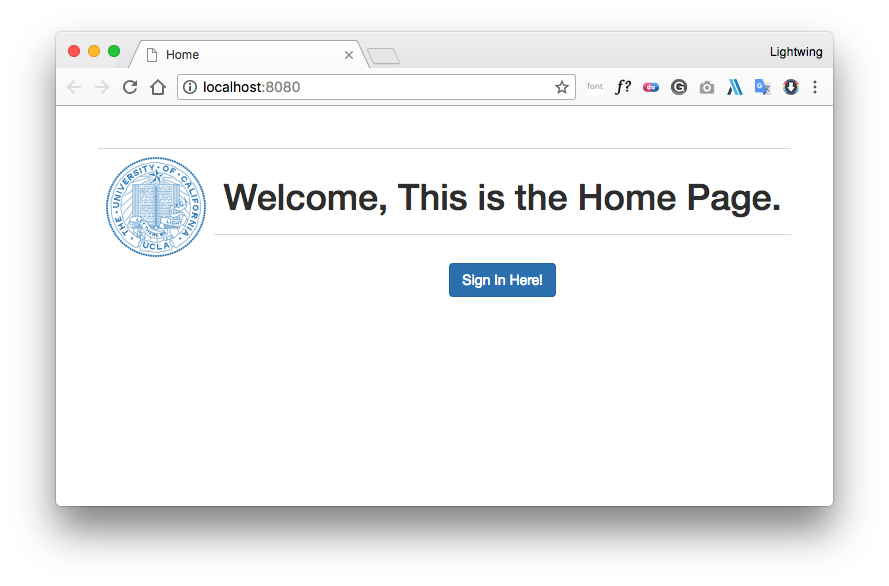
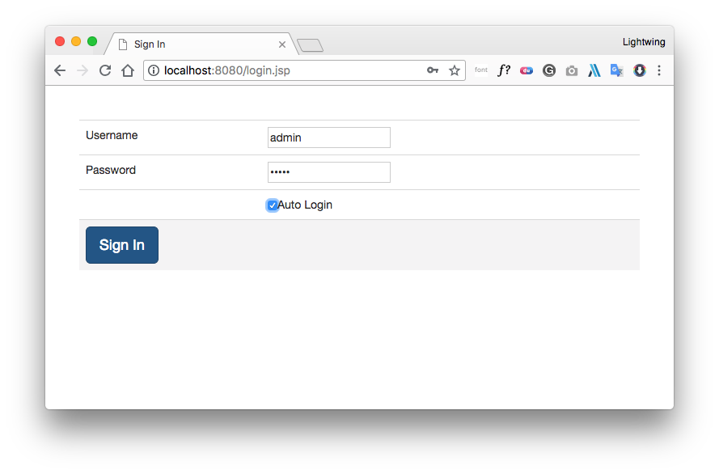
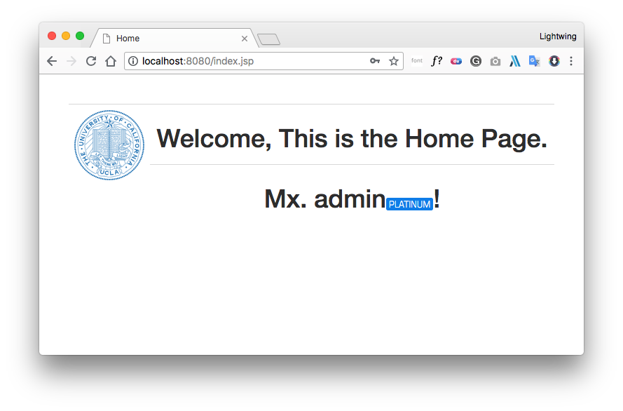

## Auto Login with Servlet/Filter

### 1 文档结构

```powershell
.
├── .DS_Store
├── .git
├── .idea
├── AutoLoginDemo.iml
├── README.md                       # 本案
├── imgs                            # README.md 的图片
│   ├── AfterLogin.png
│   ├── Login.png
│   └── WelcomePage.png
├── out                             # Output 文件
├── src
│   ├── .DS_Store
│   ├── c3p0-config.xml             # c3p0 数据库配置文件
│   └── com                         # 源代码文件
│       └── lightwing
│           ├── .DS_Store
│           ├── dao
│           │   ├── UserDao.java
│           │   └── impl
│           │       ├── .DS_Store
│           │       └── UserDaoImpl.java
│           ├── domain
│           │   └── UserBean.java
│           ├── filter
│           │   └── AutoLoginFilter.java
│           ├── servlet
│           │   └── LoginServlet.java
│           └── util
│               ├── CookieUtil.java
│               ├── JDBCUtil.java
│               └── TextUtils.java
└── web
    ├── .DS_Store
    ├── WEB-INF
    │   └── web.xml                 # Servlet 配置
    ├── index.jsp                   # 欢迎页/主页
    ├── lib                         # 依赖包
    │   ├── c3p0-0.9.1.2.jar
    │   ├── commons-dbutils-1.4.jar
    │   ├── jstl.jar
    │   ├── mysql-connector-java-5.1.7-bin.jar
    │   └── standard.jar
    ├── login.jsp                   # 登陆页
    └── static                      # 前端文件
        ├── css
        │   ├── bootstrap.css
        │   └── general.css
        ├── font
        │   └── TitilliumWeb-Thin.woff.ttf
        ├── img
        │   └── The_University_of_California_UCLA.svg
        └── js
            ├── bootstrap.js
            └── jquery-3.3.1.min.js
```
### 运行效果


